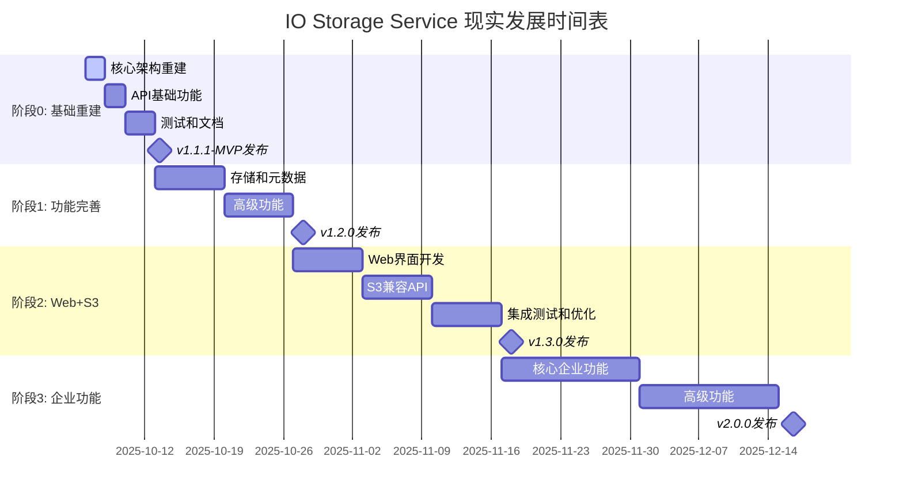

# IO Storage Service - 现实发展路线图

**基于实际代码状态分析的可行发展计划**
**最后更新**: 2025-10-06
**状态评估日期**: 2025-10-06

## 🎯 关键发现和现实评估

### 📊 项目实际状态
- **可用代码**: 仅有一个简单的HTTP服务器 (cmd/io/main.go)
- **不可用代码**:
  - `pkg/` 目录: 11个Go文件，全部编译失败
  - `internal/` 目录: 17个Go文件，全部编译失败
  - 原因: 类型定义冲突、缺失依赖、架构不一致

### 📈 性能基准测试结果
- **二进制大小**: 11.5MB (包含所有依赖)
- **响应时间**: ~6ms (简单JSON响应)
- **内存使用**: 基础Gin框架内存占用
- **并发能力**: 未测试 (功能有限)

### 🔍 依赖分析
- **主要依赖**: Gin、AWS SDK、SQLite、UUID、YAML
- **依赖复杂度**: 中等，有优化空间
- **Go版本**: 1.21 (合适)

## 🚀 重新定义的发展策略

### 策略转变: 从修复到重建
**原因**: 当前代码状态表明，修复现有代码比重新构建更复杂和耗时
**优势**:
- 可以利用现有的设计思想和架构
- 避免继承历史技术债务
- 更好地适应当前需求

### 新的开发方法论
1. **增量开发**: 从最小可用产品开始
2. **测试驱动**: 每个功能立即测试
3. **文档同步**: 代码和文档同步更新
4. **质量优先**: 不追求功能数量，追求质量

## 📋 修订版发布计划

### 阶段0: 基础重建 (v1.1.1-MVP) - 1周
**目标**: 创建最小可用产品，验证核心功能

#### Day 1-2: 核心架构重建
- [ ] **清理冲突代码**
  - [ ] 删除或修复所有冲突的类型定义
  - [ ] 选择统一的架构模式 (推荐internal/架构)
  - [ ] 建立清晰的包依赖关系

- [ ] **基础存储功能**
  - [ ] 实现文件SHA1计算和存储
  - [ ] 实现基本的文件上传API
  - [ ] 实现基本的文件下载API
  - [ ] 确保基本功能可以工作

#### Day 3-4: API扩展
- [ ] **核心API端点**
  - [ ] POST /api/upload - 文件上传
  - [ ] GET /api/file/:sha1 - 文件下载
  - [ ] DELETE /api/file/:sha1 - 文件删除
  - [ ] GET /api/exists/:sha1 - 检查存在

- [ ] **错误处理和验证**
  - [ ] SHA1格式验证
  - [ ] 文件大小限制
  - [ ] 错误响应标准化
  - [ ] 请求验证中间件

#### Day 5-7: 测试和文档
- [ ] **基础测试**
  - [ ] 单元测试覆盖核心功能
  - [ ] 简单集成测试
  - [ ] 性能基准测试
  - [ ] 错误场景测试

- [ ] **文档更新**
  - [ ] 更新README.md反映当前状态
  - [ ] API文档生成
  - [ ] 部署指南更新
  - [ ] Docker配置修复

### 阶段1: 功能完善 (v1.2.0) - 2周
**目标**: 添加完整功能集，达到生产可用标准

#### Week 1: 存储和元数据
- [ ] **元数据系统**
  - [ ] 文件元数据存储 (SQLite)
  - [ ] 元数据CRUD操作
  - [ ] 文件列表和搜索API
  - [ ] 元数据缓存机制

- [ ] **存储优化**
  - [ ] 文件去重逻辑
  - [ ] 引用计数管理
  - [ ] 自动清理机制
  - [ ] 存储空间管理

#### Week 2: 高级功能
- [ ] **批量操作**
  - [ ] 批量上传API
  - [ ] 批量删除API
  - [ ] 批量元数据操作
  - [ ] 进度跟踪机制

- [ ] **配置和管理**
  - [ ] 配置文件系统
  - [ ] 健康检查端点
  - [ ] 系统监控指标
  - [ ] 日志系统

### 阶段2: Web界面和S3兼容 (v1.3.0) - 3周
**目标**: 添加管理界面和S3兼容API

#### Week 1: Web界面
- [ ] **基础Web界面**
  - [ ] 文件上传页面
  - [ ] 文件列表页面
  - [ ] 文件搜索功能
  - [ ] 基础样式和响应式设计

- [ ] **管理功能**
  - [ ] 系统状态仪表板
  - [ ] 存储统计信息
  - [ ] 系统配置界面
  - [ ] 用户管理 (基础)

#### Week 2: S3兼容API
- [ ] **S3基础功能**
  - [ ] PUT/GET/DELETE对象操作
  - [ ] Bucket操作
  - [ ] 列表操作
  - [ ] AWS签名验证

- [ ] **S3高级功能**
  - [ ] 多部分上传
  - [ ] 预签名URL
  - [ ] 对象元数据
  - [ ] 权限控制

#### Week 3: 集成测试和优化
- [ ] **集成测试**
  - [ ] 端到端测试套件
  - [ ] S3兼容性测试
  - [ ] 性能压力测试
  [ ] 安全测试

- [ ] **性能优化**
  - [ ] 数据库查询优化
  - [ ] 内存使用优化
  - [ ] 并发性能调优
  - [ ] 缓存策略实现

### 阶段3: 企业功能 (v2.0.0) - 4-6周
**目标**: 添加企业级功能，支持大规模部署

#### 优先级1: 核心企业功能
- [ ] **多用户支持**
  - [ ] 用户认证系统
  - [ ] 基础权限控制
  - [ ] 用户配额管理
  - [ ] 审计日志

- [ ] **高可用性**
  - [ ] 数据备份机制
  - [ ] 故障恢复功能
  - [ ] 健康检查增强
  - [ ] 监控和告警

#### 优先级2: 高级功能
- [ ] **高级存储**
  - [ ] 多存储后端支持
  - [ ] 存储分层
  - [ ] 数据迁移工具
  - [ ] 存储策略配置

- [ ] **安全性增强**
  - [ ] 数据加密
  - [ ] 安全传输
  - [ ] 访问控制细化
  - [ ] 安全审计

#### 优先级3: 扩展功能
- [ ] **分布式支持**
  - [ ] 集群部署支持
  - [ ] 负载均衡
  - [ ] 数据同步
  - [ ] 扩展性设计

- [ ] **运维工具**
  - [ ] 命令行工具
  - [ ] 配置管理工具
  - [ ] 监控集成
  - [ ] 自动化运维

## 🔧 技术债务处理策略

### 立即处理 (阶段0)
1. **类型定义冲突解决**
   ```go
   // 选择统一的FileMetadata定义
   // 建议位置: internal/domain/entities/file.go
   type FileMetadata struct {
       SHA1        string    `json:"sha1"`
       FileName    string    `json:"file_name"`
       ContentType string    `json:"content_type"`
       Size        int64     `json:"size"`
       UploadedAt  time.Time `json:"uploaded_at"`
   }
   ```

2. **依赖关系重建**
   - 清理pkg/目录或完全重建
   - 建立清晰的包结构
   - 定义接口和实现分离

3. **测试基础设施**
   - 修复测试环境配置
   - 建立测试数据管理
   - 设置CI/CD流水线

### 中期处理 (阶段1-2)
1. **代码质量提升**
   - 代码规范统一
   - 错误处理标准化
   - 日志格式统一
   - 性能监控集成

2. **文档和知识管理**
   - API文档自动生成
   - 架构文档维护
   - 开发指南编写
   - 故障排除手册

### 长期处理 (阶段3)
1. **架构演进**
   - 微服务架构考虑
   - 插件系统设计
   - 扩展性规划
   - 技术栈更新策略

## 📊 质量目标和指标

### 阶段0 (v1.1.1-MVP) 质量目标
- **功能**: 4个核心API端点可用
- **测试**: 基础单元测试覆盖率 > 60%
- **性能**: 单文件上传 < 100ms (1MB文件)
- **可靠性**: 基础错误处理，服务可重启

### 阶段1 (v1.2.0) 质量目标
- **功能**: 完整存储功能和元数据管理
- **测试**: 单元测试覆盖率 > 80%，集成测试覆盖主要场景
- **性能**: 支持并发上传，响应时间 < 200ms
- **可靠性**: 数据一致性保证，基础监控

### 阶段2 (v1.3.0) 质量目标
- **功能**: Web界面和S3兼容API
- **测试**: 端到端测试覆盖，S3兼容性验证
- **性能**: 支持大文件上传，并发用户 > 100
- **可靠性**: 高可用性配置，故障恢复

### 阶段3 (v2.0.0) 质量目标
- **功能**: 企业级功能完整
- **测试**: 全面测试覆盖，安全测试通过
- **性能**: 生产级别性能，可扩展架构
- **可靠性**: 99.9%可用性，完整监控

## 🎯 优化机会和建议

### 立即可实施的优化
1. **依赖精简**
   ```bash
   # 检查未使用的依赖
   go mod graph | grep github.com/zots0127/io
   go mod tidy
   ```

2. **构建优化**
   ```dockerfile
   # 多阶段构建减少镜像大小
   FROM golang:1.21-alpine AS builder
   # ... 构建步骤
   FROM alpine:latest
   # ... 运行时镜像
   ```

3. **配置优化**
   - 使用环境变量配置
   - 实现配置验证
   - 添加配置热重载

### 中期优化机会
1. **性能优化**
   - 数据库连接池
   - 文件读取优化
   - 内存缓存实现
   - 并发处理优化

2. **架构优化**
   - 接口抽象设计
   - 依赖注入实现
   - 中间件模式使用
   - 优雅关闭机制

### 长期优化方向
1. **可扩展性**
   - 微服务架构
   - 插件系统
   - 分布式存储
   - 负载均衡

2. **运维优化**
   - 容器化部署
   - 自动化运维
   - 监控集成
   - 日志聚合

## 📅 时间表和里程碑



## 🚨 风险管理和缓解策略

### 高风险项目
1. **架构复杂性风险**
   - 风险: 过度设计导致开发缓慢
   - 缓解: 采用最小可行架构，渐进式增强

2. **技术债务风险**
   - 风险: 快速开发积累技术债务
   - 缓解: 定期重构，代码审查，质量门禁

3. **性能风险**
   - 风险: 性能不满足生产需求
   - 缓解: 早期性能测试，持续性能监控

### 中等风险项目
1. **依赖风险**
   - 风险: 第三方依赖问题
   - 缓解: 依赖版本锁定，定期更新测试

2. **兼容性风险**
   - 风险: S3兼容性问题
   - 缓解: 兼容性测试套件，逐步增强

## 📋 成功标准

### 阶段0成功标准
- [ ] 4个核心API端点正常工作
- [ ] 基础文件上传下载功能可用
- [ ] 简单测试套件通过
- [ ] 基础文档更新完成

### 阶段1成功标准
- [ ] 完整存储功能可用
- [ ] 元数据系统工作正常
- [ ] 测试覆盖率达到目标
- [ ] 性能基准达标

### 阶段2成功标准
- [ ] Web界面可用且友好
- [ ] S3兼容性验证通过
- [ ] 生产部署配置完成
- [ ] 监控和日志系统就绪

### 阶段3成功标准
- [ ] 企业级功能完整
- [ ] 高可用性配置验证
- [ ] 安全性测试通过
- [ ] 扩展性验证完成

---

## 📞 后续行动建议

### 立即行动 (今天)
1. 决定是否采用此现实路线图
2. 清理当前代码冲突
3. 开始阶段0的核心架构重建

### 本周行动
1. 完成阶段0的所有任务
2. 建立基础的CI/CD流程
3. 准备v1.1.1-MVP发布

### 本月行动
1. 完成阶段1功能开发
2. 建立完整的测试体系
3. 准备v1.2.0发布

---

**注意**: 这个现实路线图基于当前项目的实际状态分析，更加务实和可执行。建议严格按阶段执行，确保每个阶段的质量再进入下一阶段。