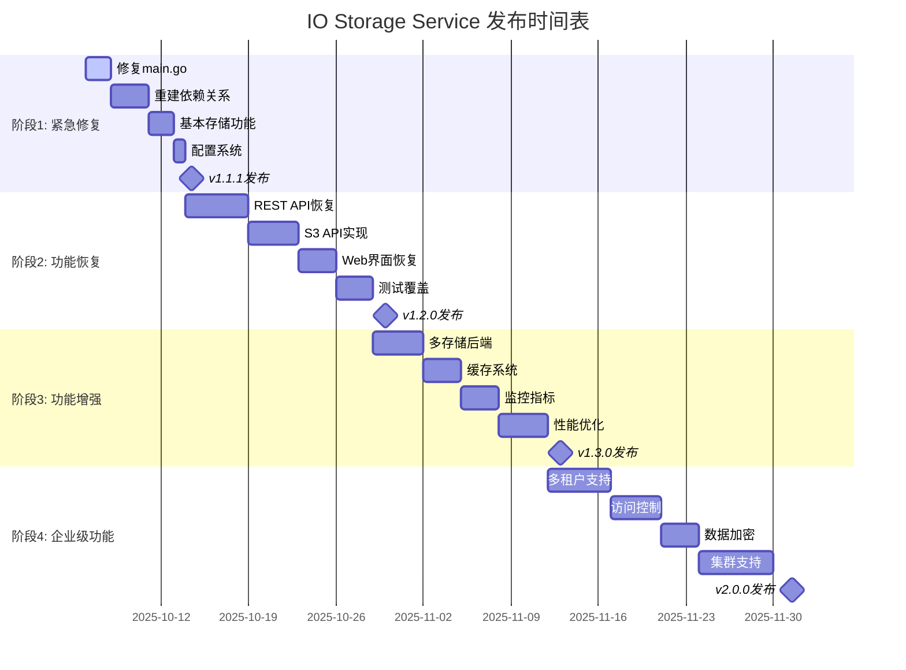

# IO Storage Service - 发布计划与功能规划

**文档版本**: 1.0.0
**更新日期**: 2025-10-06
**负责团队**: IO Storage 开发团队

## 📋 项目现状分析

### 当前问题总结

#### 🚨 严重问题 (Critical Issues)
1. **架构不一致**: 项目存在两套不兼容的代码架构
   - `pkg/` 目录: 旧架构，依赖不存在的类型 (Storage, MetadataDB等)
   - `internal/` 目录: Clean Architecture新架构，与pkg/不兼容
   - `cmd/io/main.go`: 仅简单测试服务器，未集成实际功能

2. **编译失败**: 所有pkg/包都无法编译
   - 缺少类型定义: Storage, MetadataDB, FileMetadata, BatchOptimizer等
   - 缺少函数定义: LoadConfig, InitDB, NewStorage等
   - 依赖关系混乱

3. **测试覆盖率为零**: 所有测试都无法运行
   - 集成测试需要完整的服务器实现
   - 基准测试依赖不存在的类型
   - 压力测试需要build tag支持

#### ⚠️ 重要问题 (Major Issues)
1. **功能缺失**:
   - 当前main.go只返回简单的状态信息
   - 无法进行文件存储、检索、删除等核心操作
   - S3兼容API完全不可用
   - Web界面不存在

2. **配置系统不完整**:
   - 配置文件存在但无法加载
   - 缺少配置验证机制

#### 💡 轻微问题 (Minor Issues)
1. **文档过时**: README.md描述的功能当前不可用
2. **Docker配置不完整**: Dockerfile存在但无法正常工作
3. **CI/CD流程**: GitHub Actions会失败因为无法编译

### 现有资产评估

#### ✅ 有价值的资产
1. **Clean Architecture设计**: `internal/`目录包含完整的设计
2. **测试框架**: 完整的测试结构和用例
3. **S3兼容API设计**: 完整的S3 API规范
4. **Web界面设计**: 模板和静态资源
5. **性能优化代码**: 缓存、批处理优化逻辑
6. **配置系统**: 配置文件结构设计
7. **CI/CD配置**: GitHub Actions工作流
8. **文档结构**: 完整的文档组织

#### ❌ 需要重建的资产
1. **pkg/目录下的所有代码**: 需要重新实现或修复
2. **main.go**: 需要完全重写以集成实际功能
3. **依赖关系**: 需要重新建立类型和函数依赖

## 🎯 发布计划

### 阶段1: 紧急修复 (v1.1.1) - 1周
**目标**: 恢复基本功能，使项目可用

#### 优先级 P0 (必须完成)
- [ ] **修复main.go**: 集成internal/架构的完整功能
- [ ] **重建依赖关系**: 在pkg/目录创建适配层或重新实现
- [ ] **基本存储功能**: 文件上传、下载、删除
- [ ] **配置系统**: 支持config.yaml配置加载
- [ ] **基础测试**: 至少确保主要功能可测试

#### 优先级 P1 (重要)
- [ ] **Docker支持**: 修复Dockerfile和docker-compose
- [ ] **API文档**: 更新README以反映当前状态
- [ ] **基础监控**: 健康检查端点

### 阶段2: 功能恢复 (v1.2.0) - 2-3周
**目标**: 恢复所有原有功能并增强稳定性

#### 核心功能
- [ ] **完整的REST API**: 所有原有API端点
- [ ] **S3兼容API**: 完整的S3 API实现
- [ ] **Web管理界面**: 恢复MinIO风格的Web界面
- [ ] **元数据管理**: 完整的文件元数据系统
- [ ] **数据库集成**: SQLite完整支持

#### 测试和质量
- [ ] **单元测试**: 覆盖率达到80%+
- [ ] **集成测试**: 完整的API测试套件
- [ ] **性能测试**: 基准测试和压力测试
- [ ] **安全测试**: 安全漏洞测试

### 阶段3: 功能增强 (v1.3.0) - 3-4周
**目标**: 添加新功能和性能优化

#### 新功能
- [ ] **多存储后端**: 本地、S3、MinIO支持
- [ ] **缓存系统**: Redis集成
- [ ] **监控和指标**: Prometheus集成
- [ ] **日志系统**: 结构化日志
- [ ] **认证增强**: JWT、OAuth2支持

#### 性能优化
- [ ] **批处理优化**: 文件批处理上传/下载
- [ ] **并发优化**: 更好的并发处理
- [ ] **内存优化**: 减少内存使用
- [ ] **网络优化**: 更好的网络处理

### 阶段4: 企业级功能 (v2.0.0) - 4-6周
**目标**: 添加企业级功能

#### 高级功能
- [ ] **多租户支持**: 租户隔离
- [ ] **访问控制**: RBAC权限系统
- [ ] **数据加密**: 传输和存储加密
- [ ] **备份恢复**: 自动备份和恢复
- [ ] **集群支持**: 多节点部署

#### 运维功能
- [ ] **配置热重载**: 无需重启配置更新
- [ ] **健康检查**: 详细健康监控
- [ ] **故障恢复**: 自动故障处理
- [ ] **升级工具**: 平滑升级机制

## 🗺️ 详细功能规划

### 核心存储功能

#### 1. 文件存储
```yaml
功能:
  - 基于SHA1的内容寻址存储
  - 文件去重和引用计数
  - 原子操作保证数据一致性
  - 2级目录结构优化性能

实现优先级: P0
目标版本: v1.1.1
```

#### 2. 元数据管理
```yaml
功能:
  - 文件基本信息 (名称、类型、大小)
  - 上传信息和访问统计
  - 自定义标签和字段
  - 过期时间和版本控制

实现优先级: P1
目标版本: v1.2.0
```

#### 3. 搜索和过滤
```yaml
功能:
  - 按文件名搜索
  - 按内容类型过滤
  - 按上传时间范围查询
  - 按标签和自定义字段搜索

实现优先级: P1
目标版本: v1.2.0
```

### API功能

#### 1. RESTful API
```yaml
端点:
  - POST /api/store - 文件上传
  - GET /api/file/:sha1 - 文件下载
  - DELETE /api/file/:sha1 - 文件删除
  - GET /api/exists/:sha1 - 检查存在
  - GET /api/metadata/:sha1 - 获取元数据
  - PUT /api/metadata/:sha1 - 更新元数据
  - GET /api/files - 列出文件
  - POST /api/search - 搜索文件
  - GET /api/stats - 统计信息

实现优先级: P0
目标版本: v1.1.1
```

#### 2. S3兼容API
```yaml
功能:
  - PUT /{bucket}/{key} - 上传对象
  - GET /{bucket}/{key} - 下载对象
  - DELETE /{bucket}/{key} - 删除对象
  - GET /{bucket} - 列出对象
  - POST /{bucket} - 创建bucket
  - 多部分上传支持

实现优先级: P1
目标版本: v1.2.0
```

### Web界面

#### 1. 管理界面
```yaml
页面:
  - 仪表板 - 系统概览和统计
  - 文件管理 - 上传、下载、删除文件
  - 搜索界面 - 文件搜索和过滤
  - 系统监控 - 系统状态和性能指标

实现优先级: P1
目标版本: v1.2.0
```

#### 2. 用户界面
```yaml
功能:
  - 拖拽上传
  - 批量操作
  - 文件预览
  - 分享链接生成

实现优先级: P2
目标版本: v1.3.0
```

### 性能和监控

#### 1. 缓存系统
```yaml
类型:
  - 元数据缓存
  - 文件内容缓存
  - 查询结果缓存

技术选择: Redis
实现优先级: P2
目标版本: v1.3.0
```

#### 2. 监控指标
```yaml
指标:
  - 文件上传/下载次数和大小
  - 响应时间
  - 错误率
  - 系统资源使用

技术选择: Prometheus + Grafana
实现优先级: P2
目标版本: v1.3.0
```

## 🏗️ 技术债务处理

### 立即处理 (P0)
1. **架构统一**: 选择一种架构并坚持使用
2. **依赖修复**: 修复所有编译错误
3. **类型定义**: 创建完整的类型系统
4. **测试恢复**: 确保测试可以运行

### 短期处理 (P1)
1. **代码清理**: 删除无用代码
2. **文档更新**: 更新所有文档
3. **配置标准化**: 统一配置格式
4. **错误处理**: 完善错误处理机制

### 长期处理 (P2)
1. **重构优化**: 持续代码重构
2. **性能优化**: 定期性能调优
3. **安全加固**: 定期安全审计
4. **依赖更新**: 定期依赖库更新

## 📅 发布时间表



## 🎯 质量目标

### 代码质量
- **测试覆盖率**: v1.2.0达到80%+
- **代码规范**: 使用gofmt和golint
- **文档覆盖**: 所有公共API有文档
- **性能基准**: 响应时间<100ms (小文件)

### 可靠性
- **可用性**: 99.9%+
- **数据一致性**: 100%保证
- **故障恢复**: <30秒
- **备份验证**: 每日自动验证

### 安全性
- **认证**: API密钥认证
- **授权**: 基于角色的访问控制
- **加密**: 传输和存储加密
- **审计**: 完整的操作日志

## 🚀 实施建议

### 开发策略
1. **渐进式重构**: 逐步替换不兼容的代码
2. **测试驱动**: 每个功能都要有对应测试
3. **文档同步**: 代码和文档同步更新
4. **持续集成**: 每次提交都运行完整测试

### 团队分工建议
- **后端开发**: 负责核心存储API实现
- **前端开发**: 负责Web界面开发
- **测试工程师**: 负责测试用例编写和质量保证
- **运维工程师**: 负责部署和监控配置

### 风险管理
1. **技术风险**: 保持架构简单，避免过度设计
2. **时间风险**: 优先核心功能，非核心功能可以延后
3. **质量风险**: 建立完善的测试体系
4. **维护风险**: 编写清晰的文档和注释

## 📋 检查清单

### v1.1.1 发布检查清单
- [ ] main.go集成完整功能
- [ ] 基本文件操作可用
- [ ] 配置系统工作正常
- [ ] Docker构建成功
- [ ] 基础测试通过
- [ ] 文档更新完成

### v1.2.0 发布检查清单
- [ ] 所有原有API恢复
- [ ] S3 API完整实现
- [ ] Web界面可用
- [ ] 测试覆盖率>80%
- [ ] 性能测试通过
- [ ] 安全测试通过

### v1.3.0 发布检查清单
- [ ] 新功能全部实现
- [ ] 性能指标达标
- [ ] 监控系统集成
- [ ] 文档完整更新
- [ ] 用户手册完成

### v2.0.0 发布检查清单
- [ ] 所有企业级功能实现
- [ ] 集群部署验证
- [ ] 安全审计通过
- [ ] 性能压力测试通过
- [ ] 完整的运维文档

---

## 📞 联系信息

如有任何关于此路线图的问题，请通过以下方式联系：

- **项目仓库**: https://github.com/zots0127/io
- **问题反馈**: https://github.com/zots0127/io/issues
- **讨论区**: https://github.com/zots0127/io/discussions

---

**注意**: 此路线图会根据项目进展和用户反馈进行动态调整。请定期查看最新版本。